# Overview

This repository contains the code for the web assignment portion of the Spark Systems job application. It is a Crypto
tracking/trading app, built using React, Nx, Vite and Redux. Api requests to both my own database/backend logic and
Coinbase power the data displayed. Try it out [here](https://spark.yukunxu.com)!

# Design

From the get go, I decided I wanted the page to be a grid that can be completely customised by the user, with different
widgets for each of the functions that are specified (and not specified when I was done, honestly). This had the
additional benefit of speeding up the time-to-MVP, and allowed me to develop each widget without affecting the layout of
other widgets, and the rest of the site. It did add some complexity, which we will discuss in the challenges section
later.

I also decided it would be good to get the colours of the different Spark Systems logos and corporate art used. No harm
in making it look nice and themed, right? An additional benefit here is that the rest of my personal projects also tend
to feature purple shades a lot, so this project fits right in.

For the backend portion, honestly I am not well versed in PHP at all, so when I saw that the web hosting solution I used
runs the SQL database via PHP, that portion was almost left entirely up to Claude. However, with what I did learn before
in terms of database setup and general good practices, I did make sure that the tables are set up in a way that makes
sense, without overcomplicating the setup.

## Architecture / Project Setup

The app started off running completely using redux states to track current states. I chose redux because given the scope
of the requirements and what I wanted to achieve, there would be a large amount of data, and redux helps to effectively
remove the need for constant prop drilling or finding ways around it. It also helps to cache data from the backend
responses later, allow better performance. This made the process of adding features and widgets much easier. Splicing in
the connections to APIs and further backend are simpler as well.

In general, the project is split into 2 parts, the frontend and backend basically. Focusing on the frontend, I tried to
keep the folder structure clean, by segregating component and logic files first off. I set a hard rule for both myself
and Claude to keep logic within component files under 50 lines, and move logic into a hook file specifically for that
component if that is exceeded. This helped to effectively separate concerns, increasing the readability of both logic
and component files.

To reuse code, I then made sure that any component and logic code used in multiple places are centralised in the common
directory as well.

Finally, tests are places in the src/test folder, with the relative path from the test folder matching that of the
component or logic file being tested's relative path from the src folder. This makes finding the corresponding
test-component/logic file pair much easier, helping speed up debug times. Test writing for every single component or
logic file added was then also easy to confirm, since we just need to ensure its corresponding file is there.

## Grid Design

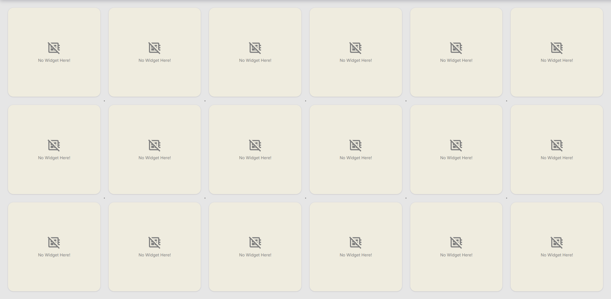

For the grid, I wanted something that looks clean, but also clearly signals to the user the layout options that they
have. It begun as a simple display of the cells that widgets would be taken up, with a small amount of spacing and dots
at each of the spacing intersection points to more clearly signify to the user where widgets will go. This has the added
benefit of making the page look very friendly, like a physical piece of paper (the fancy ones with the dotted grid).
Finally, a placeholder to show that a cell is unpopulated lets the user clearly see that that cell is not occupied.

 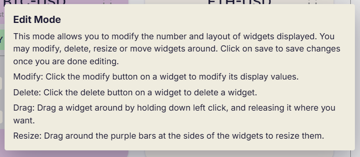

Doing the grid first also meant that I had to design the edit mode first, which would be necessary to add widgets, and
move them around. Initially, I kept it simple. There would be a button to toggle between edit mode and using mode, with
another button that allows the user to add more widgets in edit mode. We also need the drag action to allow users to
move widgets around. Later on, icons for each widget were added, along with tooltips to explain the function of each
button.

Buttons for pausing live updates and adjusting update delay were added too. These were originally going to be edit mode
only, but I decided that they should be in the using mode as well, since they tend to be more spur of the moment
decisions from users, and gating it beyond additional actions makes no sense. Editing layout and widgets present is a
more disruptive and intentional decision, so we do not want users to accidentally trigger those actions while trying to
just use the application.

Finally, we add the ability for user to add widgets in 2 ways:

1. add a widget in first empty slot by clicking widget button
2. add a widget in specific location by dragging widget button out onto the grid

The second action is just a nice to have :)

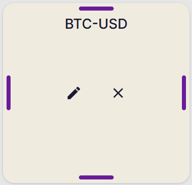

For the added widgets in edit mode, edit and delete buttons on each widget were used to, well, edit and delete added
widgets. Beyond the initial features, later on we had larger widgets, which can be resized to allow more data to display
per widget. This necessicated a way to resize the widgets, which I accomplished using little bars in the padding of the
widgets. Code wise, this necessitated a minimum size gate for certain widgets that would look off when resized too much,
along with snapping to prevent sub-grid sizes of widgets.

### Edit Mode: Instrument Widget

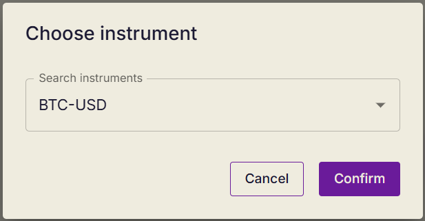

For the instrument widget, we can simply search for a instrument to track, and either confirm to set it as the tracked
instrument, or cancel to not change the value. By default, the BTC-USD value is populated.

### Edit Mode: Watchlist Widget

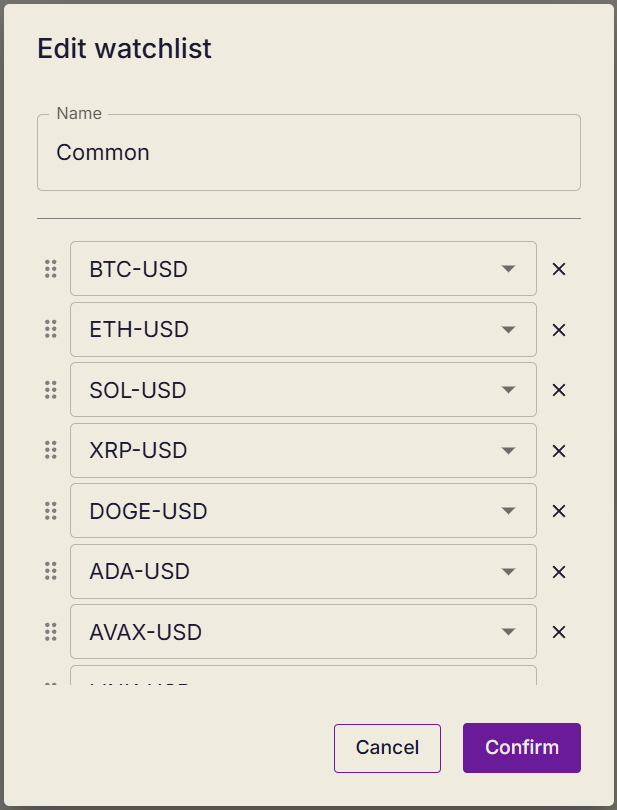

For the watchlist widget, we can edit both the name of the watchlist and items in the watchlist. Each item in the
watchlist has 3 actions: reorder, edit and delete. At the bottom of the list, there is an empty text field to add more
instruments to the watchlist.

### Edit Mode: Orders Widget

The orders widget does not have anything to edit in edit mode other than its size and deleting it for now, so that's all
we have.

## Widget Design: Instrument

### Unexpanded View

The first widget I made was the lowest hanging fruit: the single instrument tracker. It is a 1x1 widget that tracks (as
its name suggests) a single instrument.

To keep things simple, we start with just the title and last updated time at the top, letting the user know which
instrument is being tracked and how fresh the data is, which I figure would be important to users. Finally, a button on
the right of the title allows users to expand the widget to view more information about the instrument in a pop up
dialog.

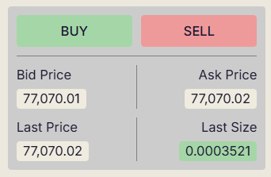

The content in the unexpanded widget should be kept brief, since this widget takes up the least space. However, we try
to display as much data as possible in this space. To this end, we have current prices displayed here for both bid and
ask, as well as the price and size of the last trade of the instrument. To pack more data, we even coloured the cell
that the last trade size value sits in according to whether the last trade was a buy or sell. Finally, we have the buy
and sell buttons at the top of this panel, which is the main purpose of the single instrument widget: to allow users to
really focus on this more important instrument and be able to buy and sell it as fast as possible.

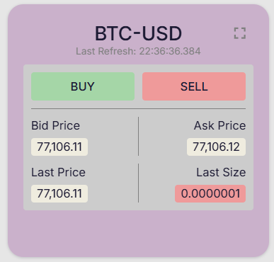

After the basic functionality of the widget was completed, it was time to add some (really useful) flair. I realised
that it was difficult to tell when new values appeared, since the text is not exactly huge. Given that this widget is
for the user to really focus on specific important instruments, something that unmistakeably alerts users to changes in
values would be preferred. Inspired by the flashing effects on other aggregator websites when fresh instrument data
comes in, I did a similar effect, themed to our website's colours and fading out after a while to also give a visual
indicator of how long it has been since the previous update.

### Expanded View

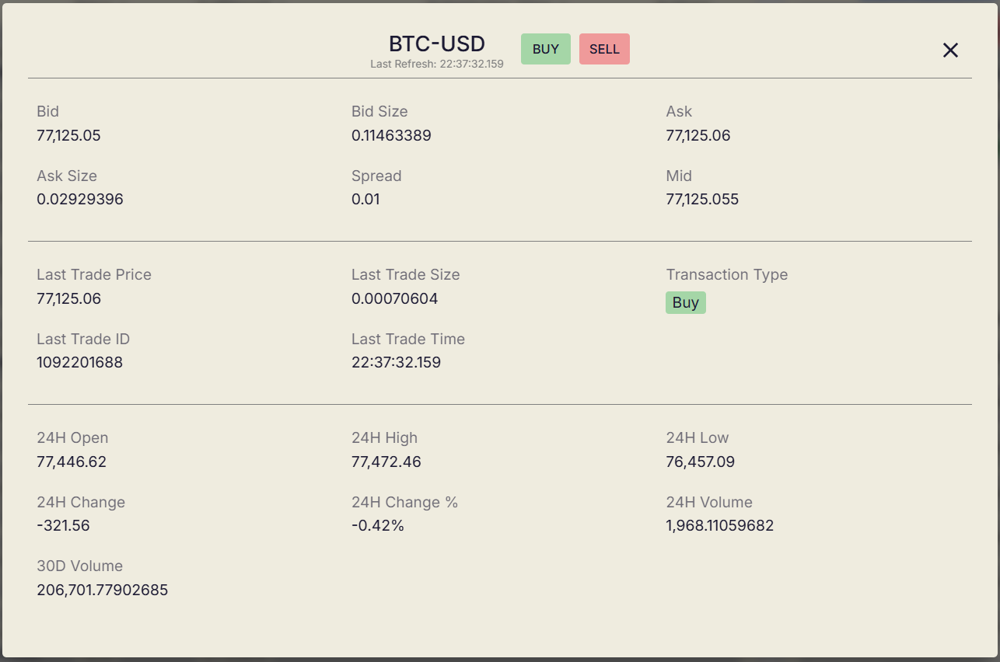

For users who want to see more information about the specific instrument, we then have the expanded version of the
widget that appears when the user clicks on the expand icon, or anywhere on the widget that is not the buy/sell buttons.
This brings up a larger pop up that shows more information, and stops ticking instruments that are being tracked in
other widgets, allowing the user to fully focus on the data in this widget and saving on performance. A blur is also
applied over the background to prevent distractions.

## Widget Design: Watchlist

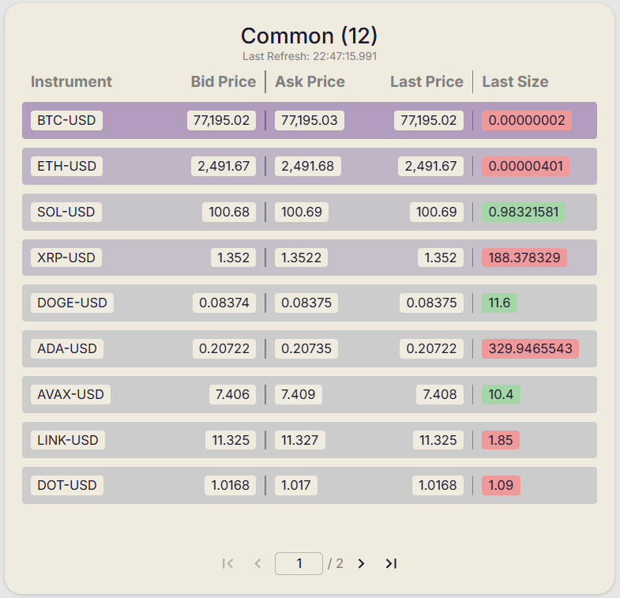

Not every instrument is as important, of course. Some users may also be more able to handle a denser information load at
once, so we have our second widget, the watchlist. This widget is used to track as many widgets as the user wants at
once, so long as it fits on screen. To save space, I compressed the data points displayed in the singular instrument
widget down to a single row, and let the rows pulse when updates come in. The space for the labels is also saved, by
having a single header row for the whole table. Thus, much more data can be fit into the same area. Last refresh time is
now a single value for the whole watchlist, since the user can see the most purple item to tell which item it was that
updated, and all the other data would be accurate to that time with how the websocket connection works. Clicking on a
row will also allow the user to open up the same expanded details panel that you can access by clicking on the single
instrument widget.

Initially, I allowed the watchlist to scroll if the user adds to many items to display in the height of the widget.
However, this not only uses up more bandwidth for instruments that the user can't even see yet, and also does not feel
elegant. Instead, we have the number of total items in the watchlist appended to the title, and have a pagination
element at the bottom for users to move between pages of the watchlist to see more instruments. Finally, we lock the
widths of the columns instead of allowing them to hug the contents, so the table does not continually shift around as
new data with different value lengths come in.

## Widget Design: Orders

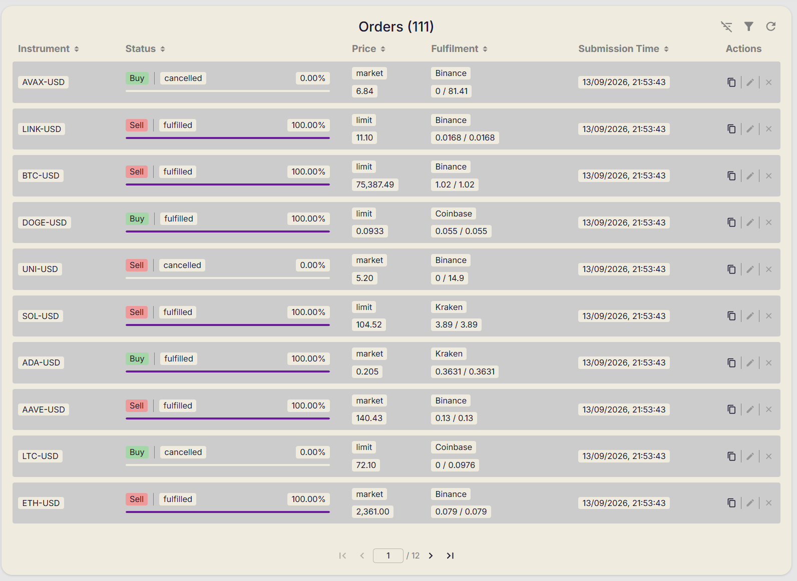

The final widget completed was the order widget. This widget is used to display all orders tied to the user account. Of
course, these are not real. But for some semblance of realism, I will cover the barebones "order fulfilling" server in a
later section. The main content in this widget is the orders table. Each row displays all the data points we filled in
the order form, along with more data points related to order execution. Again, the table columns are fixed width to
prevent shifting, and the pagination element is here again, since one user could easily place a lot of orders.

Since there is more than enough space in the widget, let's add another column for actions that can be done on orders as
well. There are 3 actions: copy, modify, and cancel. These do exactly what you think they do. The copy button copies an
order's parameters into a new order form for quick repeating of orders. Modify allows you to change an order that is
pending fulfilment or is fulfilling. Finally, cancel allows you to cancel any pending or fulfilling orders. These are
common actions that I feel like users might want to do on orders. A little design decision here, for modify order, the
amount I prefill to include in the order amount here is the remaining amount yet to be fulfilled, so that the already
fulfilled portion does not get modified by the user.

There are also 3 actions that apply to the table contents at the top right. These are the clear sorting, filter, and
refresh buttons. The order of the effects being applied is filtering first, followed by sorting, and finally by
pagination. This allows filtering to get rid of some items first, reducing the load of sorting, and pagination needs
filtering and ordering results in order to display sorted data, so it comes last.

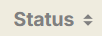  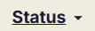

The table supports sorting of items based on any column by clicking on the header, and this is communicated to the user
via the arrows beside the table header. The column being actively used for sorting is also differentiated with colour
and underlining to visually show the user that information. The clear sorting button is used to clear any sorting, but
clicking the same header repeatedly also allows the user to toggle their way back to their state.

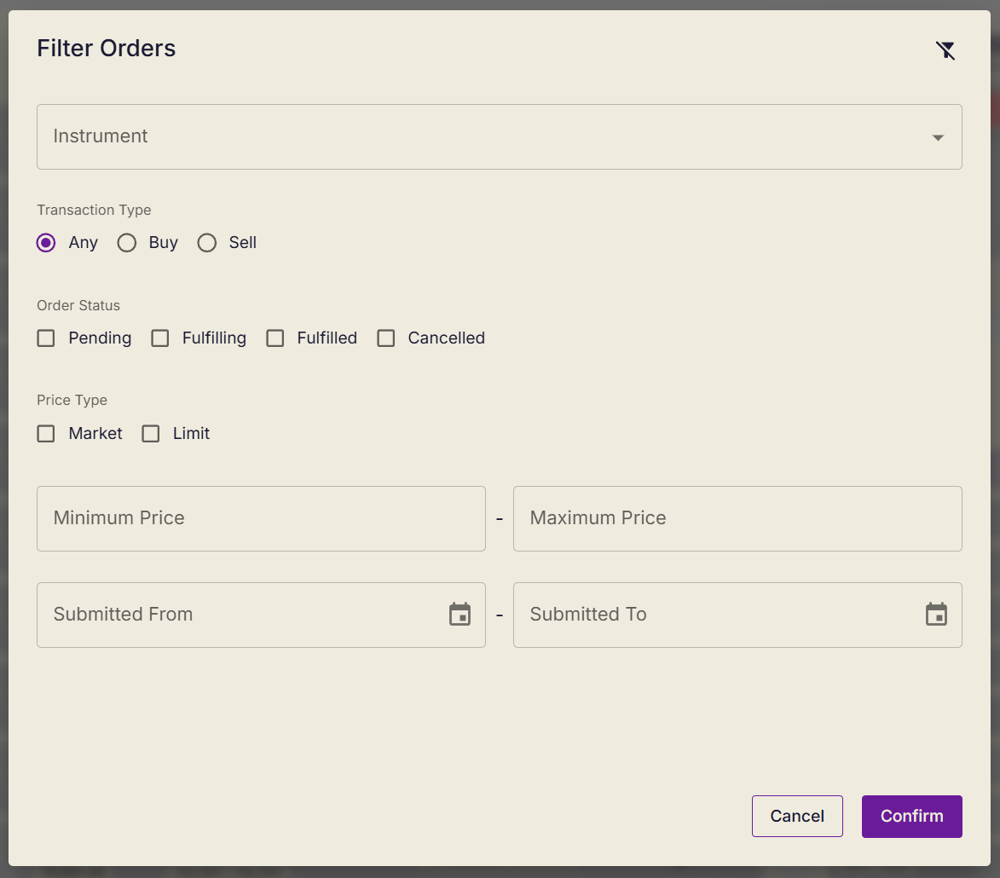

The filter button brings up the filter pop up. This pop up allows the user to filter the orders. There is a clear filter
button at the top, and any unpopulated portions in this form simply leave that portion unfiltered. As long as there are
changes to filter values, the user will be placed on page 1 to prevent breaking of pagination by the user being on an
out-of-range page. The filter icon above the table will also be focused to show that the filter is active.

The reload button is the simplest, and simply refetches all orders, with the current filters/sorting/pagination applied.

While the buttons are displayed here, the logic that powers them are actually in the PHP code, and the frontend here
just sends the payload to give the backend information on what we want. While this is a web assignment, I believe having
this logic backend is the better design decision and the frontend should "know" just what it needs.

## Order Form Design

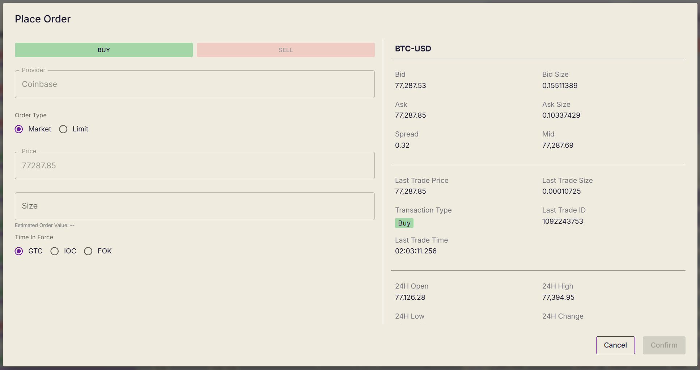

The order form allows users to "place orders". In this case, we have the form on the left, and a details panel on the
right, which displays the same live ticking data that would be present on the expanded instrument tracker widget, just
displayed in a more compact manner with scrolling required.

The form on the left has basic validation and warning messages for wrong values, with the confirm button used to submit
the order disabled on the bottom right until the user has filled valid values. For certain form choices, fields are
disabled as well and values are automatically set if they are invalid for those choices.

This same form is used for copying and modifying orders. With the caveat that we also disable toggling the buy/sell for
modified orders, since it would not make sense for the user to do.

## User Auth Design

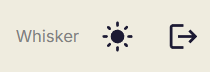 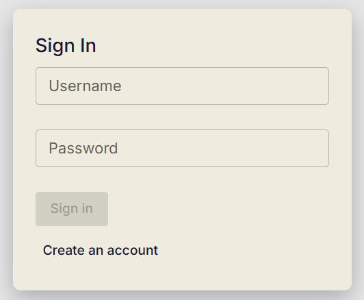 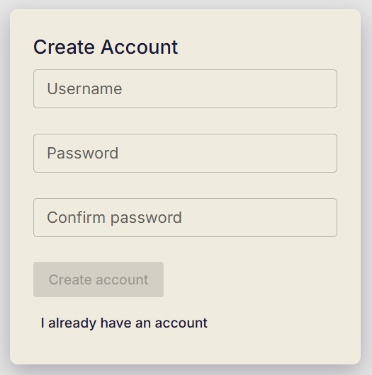

For the user and authentication portions, it was purposefully kept simple. Since it was out of scope, it is just a
simple username and password creation/login process, since we are just using it to separate the data by user. In the
cluster of buttons at the top right once logged in, we get to see our username, along with 2 buttons. The first allows
us to set the theming of the app (I really like dark mode, so that was one of the first things I added :P). The latter
is for logging out. This also helped testing since it allowed me to create different users to test different issues,
whether they are related to completely new users or very well used accounts, without resetting my progress in other
accounts.

# Challenges

Honestly, most of the challenges here really stemmed from my own perfectionism and scope creep. But hey, I had time to
burn during the weekend and it was an enjoyable project, so I'm happy to have embarked on it. The section specific
challenges are outlined below. In general, most of the challenges I faced were actually in terms of optimising the
frontend app, since there are actually a lot of moving parts and components to display, so making sure the site
functions well on lower end devices took some work, given the requirements for the site to be able to display a sizeable
amount of data at a frequent rate smoothly.

One of the challenges plaguing the whole page was actually cutting down on loading times. As the saying goes, make it
work, then make it fast. After completing the feature portion, I then decided to improve initial load times. The biggest
solution here was, of course, lazy loading. By memoising components in places, and having lazy-load in others along with
loading skeletons, the loading time on slow devices was cut from 13 seconds to 3 seconds. (Devtools 14x throttle,
benchmarked to slow mobile devices) I was happy with the timing, so I stopped there.

## Authentication

To preface, this app is just a "dummy" app that will never see the light of day and does not really need too much focus
on security per-se, since no personal data will be put on it anyway. (PLEASE do not use your actual passwords here???)
However, I am still not really familiar with securing the whole fullstack chain, and I have done my best with what I do
know in terms of maintaining a need-to-know basis for data sharing, and ensuring that the backend database is only
accessible by the correctly authenticated user.

However, the presence of this authentication portion itself also added complexity, since I would have to have
workarounds for local testing. Luckily, this app is not too big, so deployments do not take too long.

## Grid

While I have worked on drag and drop solutions before, this was the first time I did something this ambitious. The
saving grace was that instead of allowing the user to set the widgets to ANY size, I decided from the get-go to use a
grid with fixed cells. This really helped with the complexity with implementing such a system, and I personally think
it's more sleek and intuitive to use.

## Instrument Widget

This widget was actually fairly easy to implement, however making sure that it correctly displays on different monitor
resolutions took some work. Given the time, I decided to cater to the most common resolutions, but if given more time I
would not just want to fix it to display on more devices, but even figure out a mobile version.

## Watchlist Widget

The implementation here was greatly eased by prior work to polish the instrument widget. However, the flash that used to
happen just once per widget now happens very frequently. To reduce the load on the browser, the solution was to use refs
to render the flash, instead of the "React" way of causing redraws. This was quite a significant performance leap,
allowing the delay from updates to the next page draw to drop from about 1 second to under our fastest refresh time of
250ms. Since I had never attempted this method of optimisation before, it was fun figuring out the mechanics and logic
behind doing it.

## Orders Widget

The UI part of the orders widget was not difficult, as most the more "complex" logic was in the PHP code, which I do not
know too well and mostly delegated to Claude anyway. However, I did enjoy the challenge of figuring out how to display
the data points in a way that makes sense to the user, and is also intuitive for users who have used similar apps
before, or even encountered similar table-related UI elements before.

# Future Plans

To preface, I doubt I will ever work on this project again, unless it somehow goes viral and gets super popular, which
would make no sense for it to currently. However, as a thought exercise, I thought it would be interesting to go through
what I gave up on in the interest of, well, the time I have.

My first goal if given more time would be to adapt the website to work on mobile too. Only having a desktop site for
this is generally well and good, since people are generally more trusting of their desktop devices when doing things
that tend to concern their assets and moving around possibly large sums of money. However, for many people, especially
younger users, the mobile phone is just as trustworthy, and has the added benefit of giving you basically all-day access
to the tools you need. This is a large portion of users being given up without a mobile site. Furthermore, more people
likely own a smartphone, as opposed to full powered desktop devices, so that's another drop in potential users.

Another goal I had was to have more widgets to give the user more information on their assets. While users are now able
to see live instrument data, as well as place and view orders with quite a good range of options in terms of arranging
that data, there lacks a way for the user to see their combined holdings. Having a widget with this data will also make
the mocked order experience more realistic, since we will be able to show the user how much of an instrument they can
actually sell and validate against that.

Early on, I wanted to add the ability for the user to add more rows to the grid, to allow for even more
functionality. Thinking more along those lines, I thought that maybe having customisable tabs in the banner to allow
this expandability would make more sense. However, given the time constraints I decided not to pursue it.

Finally, as low-hanging fruit, adding another connection to Kraken in addition to Coinbase for both redundancy and more
user choice would have been cool as well, especially since I already have the form field wired up in the order form.

# Overall Thoughts

Did not think I would have so much fun with this. Going for a more simple yet elegant design language here really helped
the feel of the app as a polished, powerful and no-frills financial tool. This is my first time hooking up a database to
a personal frontend project as well, and it has made the process much less daunting for me, so I look forward to doing
that more often in the future.

The challenges faced were also quite unique to this project, since it was the first time I had to make an application
that responds with high volumns of data at high frequencies, and it was really interesting figuring out how to optimise
the performance. If the actual job scope is anywhere close to this, I think I will have a blast learning and solving
problems.